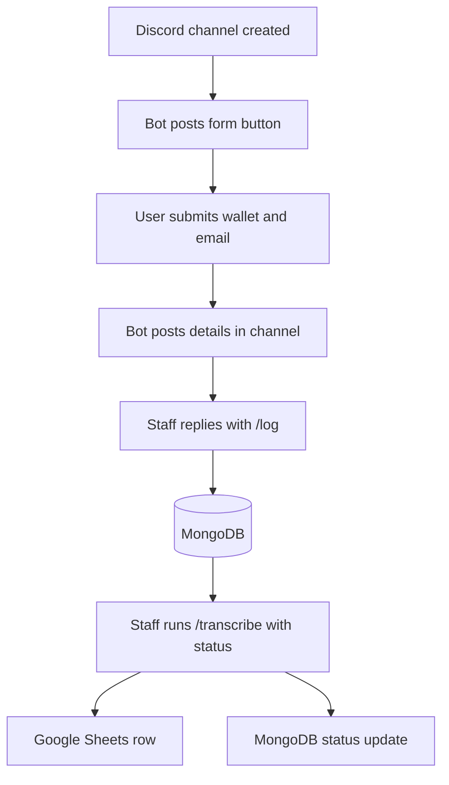

# TicketPrompt

TicketPrompt is a Discord bot that collects a support user's wallet address and email in a channel, records the details in MongoDB, and lets staff copy a ticket outcome to Google Sheets. It is intended for teams that use Discord channels as support tickets and need a shared record of contact details and status.

## How it works



1. `on_guild_channel_create` posts a **Feedback Modal** button to every new guild channel the bot can access. There is no ticket-channel filter.
2. The modal collects a wallet address and email. On submission, the bot posts a confirmation and a separate four-line message containing wallet, email, Discord handle, and channel name. Both are visible in the channel.
3. A staff member replies to the four-line message with `/log`. This is a `discord.py` **prefix command**, not an application command. It fetches the replied-to message, splits it on newlines, and inserts a `Pending` record into MongoDB. The ticket open date comes from the channel creation date.
4. A staff member runs the `/transcribe` application command with `Resolved`, `Unresolved`, or `Unresponsive`. It finds a record by current channel name, writes columns A–G in the first worksheet of **Ticket Process Transcripts**, then updates the MongoDB record's sync flag, close date, and status. If no record matches, it responds `Failed.`

The bot does not create or close ticket channels. It does not read conversation history, generate prompts, use an AI model, or run scheduled jobs. Logging and transcription are separate manual steps.

## Architecture and integrations

| Component | Role | Authentication/configuration |
| --- | --- | --- |
| Discord via `discord.py` | Channel event, modal/button, `/log`, `/transcribe` | `JAKEY_DC` bot token; Message Content Intent and channel/application-command permissions |
| MongoDB via `pymongo` | Stores records in `Handybot.ModalForm` | `MONGO_PW` password for the URI embedded in `main.py` |
| Google Sheets via `gspread` | Stores a seven-column ticket outcome row | Service-account JSON at `envs/credentials.json`; access to **Ticket Process Transcripts** |

`main.py` is the only entry point. At import/startup it authenticates to Google Sheets and opens the spreadsheet, loads the environment file, creates a MongoDB client, registers Discord handlers, and calls `bot.run(token)`. `/log` calls MongoDB synchronously; `/transcribe` runs blocking MongoDB and Sheets operations in an executor. There is no central retry or logging layer; startup and unhandled handler failures appear in process output.

## Project structure

```text
ticketprompt/
├── main.py           # Active bot and integrations
├── doctemplate.py    # Unused draft ticket schema; not imported by main.py
├── requirements.txt  # Pinned Python environment
└── README.md
```

`doctemplate.py` has a syntax error in its `needed` dictionary and is not a working runtime module.

## Requirements and installation

No Python version is declared by the repository. The pinned `audioop-lts` package targets Python 3.13 and newer, so use **Python 3.13 or newer** with these pins, subject to package availability on your platform. Live compatibility has not been verified.

You need a Discord bot installed in the server, a reachable MongoDB Atlas cluster matching the URI in `main.py`, and a Google service account with spreadsheet access. Enable Discord's **Message Content Intent** for the prefix command. Grant the bot permission to view channels, read message history, send messages, and use application commands. Slash commands are synced on bot readiness.

From the repository root:

```powershell
python -m venv .venv
.venv\Scripts\Activate.ps1
python -m pip install -r requirements.txt
```

On macOS/Linux, activate with `source .venv/bin/activate`. The requirements file is a pinned environment with packages not imported by the active bot; it lists both `dotenv` and `python-dotenv`. `main.py` uses `load_dotenv` from the `dotenv` module.

## Configuration

`main.py` loads `../../envs/handybot.env` relative to its own file. Variables already set in the process environment are also usable. The Google credential path is resolved relative to the **working directory**, so start the bot from the repository root.

```env
JAKEY_DC=replace_with_discord_bot_token
MONGO_PW=replace_with_mongodb_password
```

| Variable | Required | Purpose |
| --- | --- | --- |
| `JAKEY_DC` | Yes | Discord bot token passed to `bot.run` |
| `MONGO_PW` | Yes | Password interpolated into the MongoDB Atlas URI |

Create `envs/credentials.json` under the repository root with a Google service-account key and share the spreadsheet **Ticket Process Transcripts** with that account. Do not commit credentials. The current `.gitignore` excludes `.env` and `credentials.json`, but not `handybot.env` by name.

The MongoDB username, host, database, collection, and spreadsheet title are hardcoded in `main.py`. A password containing URI-reserved characters needs percent encoding for the current connection-string construction. The Sheet receives open date, Discord handle, channel name, selected status, wallet/email text, transcription date, and staff username in columns A–G.

## Run

From the repository root, after configuration:

```powershell
python main.py
```

Successful Discord connection prints `We have logged in as ...`. Startup attempts Google authentication and opens the spreadsheet before connecting to Discord, so missing or inaccessible Google credentials can stop the process first.

## Troubleshooting and limitations

| Symptom | Check |
| --- | --- |
| Startup fails before Discord login | Check `envs/credentials.json`, spreadsheet title, sharing, and Google API access. |
| Discord login fails | Check `JAKEY_DC` and bot authorization. |
| `/log` does not respond | Check Message Content Intent, bot permissions, and that the command replies to the four-line details message. |
| `/log` raises an error | The referenced message may lack four lines, or MongoDB may be unavailable. |
| `/transcribe` says `Failed.` | No MongoDB record matches the current channel name; use `/log` first. |
| Sheet write fails | Check service-account access and the first worksheet; inspect process output. |

The code has no moderator permission checks on `/log` or `/transcribe`, input validation, duplicate prevention, or restriction to ticket channels. Renaming a channel after `/log` can break the later lookup. Repeated `/transcribe` calls can append duplicate rows. Row selection uses first-column length plus one, so concurrent transcriptions can collide. A successful Sheet write followed by a failed MongoDB update can leave inconsistent state. The channel contains wallet and email details, so restrict channel access accordingly.

## Development and validation

Keep the modal's four-line message aligned with positional parsing in `/log`. Sheet layout changes also require updating the `A:G` write in `/transcribe`. There are no automated tests or deployment files in this repository.

During this audit, `main.py` parsed successfully with Python 3.14.7; `doctemplate.py` failed due to a missing comma. The local environment lacks `discord.py`, `gspread`, and `pymongo`, so imports and live runtime behavior were not validated. `pip check` found no broken packages among already installed packages; this does not validate `requirements.txt`. Dependency installation and live Discord, MongoDB, and Google Sheets calls were not performed. No production messages or data writes were triggered.
